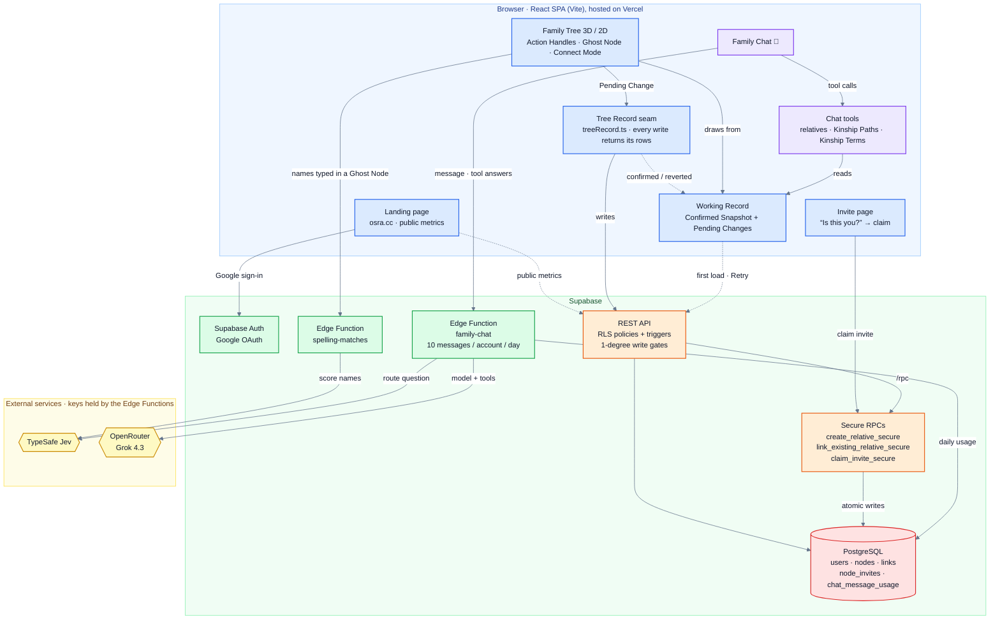
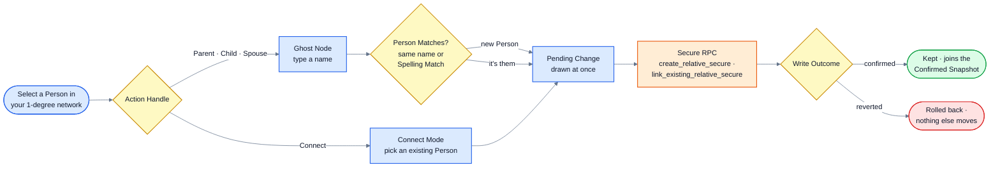
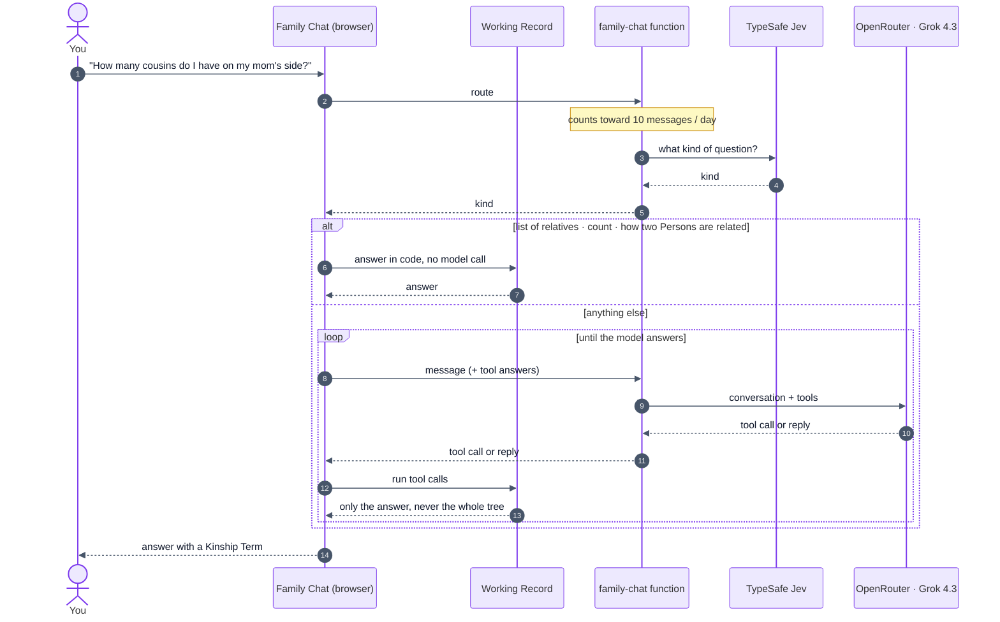

# Osra: 3D Family Tree Visualization

**Osra** is an interactive 3D & 2D family tree visualisation that transforms complex genealogical relationships into an immersive, explorable 3D space. Built with React, TypeScript, and Three.js, this app combines sexy real-time 3D graphics with Supabase-powered authentication and permission controls.

## Overview

My goal was to create a collaborative family tree platform where multiple family clusters can coexist and interconnect through marriage links, where everyone signed in sees the whole tree, but each user can only edit their immediate family network (self, parents, children, siblings, spouse, and step and co-parent equivalents). With a little bit of fun.

## System Architecture



The browser draws the tree from the **Working Record** and sends every change through one write seam; Supabase's RLS policies, triggers and secure RPCs decide whether it is allowed. The chat and Spelling Matches run in Edge Functions, so no model or TypeSafe key ever reaches the browser.

### Onboarding

<!-- markdownlint-disable MD033 -->
<p align="center">
  
</p>
<!-- markdownlint-enable MD033 -->

### Adding a relative



Divorces, standalone Persons and Dissolve (removing a Person or link) are admin-only. Invites are made from the Person drawer.

### Asking the family chat



### The Flow

This project was built progressively, with each step unlocking the next capability.

1. **Visualization**: Family trees are networks, not hierarchies—added **force-directed graphs** so physics naturally clusters related nodes.

2. **Third dimension**: Clusters overlapped in 2D—added **3D with react-force-graph-3d**, giving each cluster its own region and marriage links as bridges.

3. **Collaboration**: Integrated **Supabase + Google OAuth** for sign-in and shared data storage.

4. **User identity**: Built the **node binding system** so each account connects to exactly one family node.

5. **Edit permissions**: Implemented the **1-degree network rule**—users edit only self, parents, children, siblings, and spouse.

6. **Database enforcement**: Added **PostgreSQL RLS policies** with custom functions to validate graph relationships.

7. **Controlled growth**: Built the **invite token system** so existing members invite new ones to claim specific nodes.

8. **Visual clarity**: **Color-coded links**—parent (blue), marriage (amber), divorce (grey)—for instant readability.

9. **Starship navigation**: Developed **FPS-style controls**—WASD thrust, mouse steering—so exploration feels like flying through space.

10. **2D presets**: Added **Family Presets** with orthogonal elbow connectors for clean hierarchical views.

11. **AI chatbot**: Implemented a **person-centric AI** that understands relationships and supports cloud/local LLMs.

12. **Visual upgrade**: Added **planetary nodes**, 3D starfield, nebulae, and a cinematic intro fly-in.

13. **Osra rebrand**: Renamed the app, added **regional background grouping**, and personalized the chatbot for signed-in users.

14. **Security hardening**: Added **one-time invites**, identity verification ("Is this you?"), and chatbot gating inside auth.

15. **Landing page**: Built the osra.cc marketing page with scroll-driven 3D hero and How It Works.

16. **Direct manipulation**: Added **Action Handles, Ghost Nodes and Connect Mode** so relatives are added and linked on the canvas itself, in 2D and 3D, with Spawn and Dissolve animations.

17. **One write seam**: Every write goes through the **Tree Record seam** and returns what it wrote; the browser keeps a **Working Record** (Confirmed Snapshot plus Pending Changes) so changes show at once and roll back cleanly.

18. **Server-side gates**: RLS, triggers and RPC checks now refuse forged writes; standalone Persons and divorces are admin-only, and invite tokens are one-time and expire.

19. **Spelling Matches**: TypeSafe Jev flags existing Persons whose name is a different spelling or transliteration ("Mohamed" / "Mohammed") before a duplicate is added.

20. **Server-side chat**: The family chat moved to a Supabase **Edge Function** (no model key in the browser), with a daily limit, Jev routing common questions to code, and Kinship Terms for "how are we related?".

21. **Both parents linked**: Existing children were given a `parent` link to each known parent, mother and father, while the tree still draws one line. Adding a child in the app still links only the chosen parent until LIN-79.

Each solution unlocked the next challenge, building from a simple graph into a fully collaborative, permission-controlled family tree platform.

## Features

### Family Chatbot

- **Floating assistant (🤖)**: Knows who is signed in and answers questions like "Who is my father?" or "How many cousins do I have on my mom's side?". The model runs on the `family-chat` Edge Function, which holds the key and allows 10 messages per account per day. TypeSafe Jev reads each message first; for the common kinds (a list of relatives, a count, how two Persons are related) code answers from the Working Record with no model call. Otherwise, when the model needs a fact it calls a tool; the browser runs the tool on the Working Record and sends back only the answer, never the whole tree. Read only.

### Core Functionality

- **3D Force-Directed Graph**: Physics-based layout using react-force-graph-3d.
- **Regional Background Grouping**: In Family Presets, connected background sub-trees are automatically grouped behind their anchors using a Z-axis spiral spread to prevent collisions.
- **Multi-Cluster Architecture**: Multiple family clusters spatially separated in 3D space.
- **Marriage Links**: Visual bridges connecting different family clusters.
- **Starship FPS Navigation**: Immersive mouse steering and WASD movement with fixed zoom/trackpad responsiveness.
- **Dynamic Node Interaction**: Click-to-focus and Tab-based node cycling with a glowing aura.
- **Planetary Textures**: Realistic 3D planet skins for nodes with continuous rotation and dynamic lighting.
- **Multi-Style Rendering**: Toggle between futuristic metallic Spheres (default), Planets, or no texture.
- **True 3D Starfield**: Immersive 8K backdrop with multi-layered parallax stars and galactic dust core.
- **Procedural Nebulae**: High-detail, volumetric gaseous clouds (Trifid and Helix styles) with organic motion.
- **Cinematic Intro Zoom**: Dramatic 30,000-unit "fly-in" from deep space upon app entry.
- **Ambient Cosmic Music**: Immersive background audio synced with the cinematic entry (default ON).
- **Celestial Body Mode**: Toggle links visibility to see family members as floating stars in deep space.
- **Background Themes**: Deep space, wax white, smooth sepia, or baby blue.
- **2D View**: Tree, cluster and radial layouts with orthogonal elbow connectors, pan and zoom.
- **Direct Manipulation**: Action Handles (Parent, Child, Spouse, Connect, Dissolve) on each Tree Node in 2D and in a docked panel in 3D; a Ghost Node previews a new Person before it is written. Desktop only; phones use the Person drawer.
- **Person Matches**: While adding someone, existing Persons with the same name or a Spelling Match are offered so the tree does not get duplicates.
- **Search**: Find a Person by name (Ctrl/Cmd+F) within the selected family, in 2D and 3D.
- **Clean UI**: Centralized selection panel and settings gear (⚙️) for an unobstructed view across 3D and 2D modes.
- **Landing (osra.cc)**: Scroll-driven 3D node graph hero, Meet Osra copy, 3-step How It Works, CTA.

### Navigation Controls

- **R**: Toggle Steering Engine (Enable/Disable Mouse Look)
- **WASD / Arrows**: Forward/Backward thrust and Strafe Left/Right
- **Q / E**: Roll view left / right
- **Shift**: Speed Boost
- **Tab / Shift-Tab**: Cycle through family members
- **Enter / Space**: Precision warp to selected node
- **Esc**: Step back out of the current action, then deselect
- **Mouse**: Directional steering (when engine is ON)

### Authentication & Permissions

- **Google OAuth Integration**: Seamless sign-in via Supabase Auth
- **Node Binding System**: Users bind to specific family tree nodes via invite tokens
- **Hardened 1-Degree Model**: Every signed-in, bound user can read the whole tree; writes are limited to their 1-degree network and enforced in the database ([ADR 0013](docs/adr/0013-server-side-write-authorization.md))
- **Atomic Operations**: Secure RPC functions (`create_relative_secure`, `link_existing_relative_secure`, `claim_invite_secure`) for data integrity
- **One-Time Invites**: Invite links expire after 7 days and can be claimed once, after an "Is this you?" check
- **Role-Based Access**: Admin role for full tree management (standalone Persons, divorces, deletes, link repair)

### Relationship Types

- **Parent Links**: Vertical family structure. A child can have a `parent` link to each known parent (with a mother/father role, set from the parent's gender), but the tree draws one line ([ADR 0012](docs/adr/0012-store-both-parent-links-draw-one.md))
- **Marriage Links**: Cross-cluster connections with distinct visual styling
- **Divorce Links**: Recorded by admins only
- **Siblings**: Not stored; worked out from shared parents

## Tech Stack

### Frontend

- **React 18** + **TypeScript**: Type-safe component architecture
- **Material UI (MUI)**: Buttons, Switches, theme (`src/theme/osraTheme.ts`). Tree app UI uses MUI + react-spring for expandable panels.
- **react-force-graph-3d**: Three.js wrapper for 3D force-directed graphs
- **Three.js/WebGL**: Hardware-accelerated 3D rendering
- **D3** (hierarchy, zoom, shape): 2D layouts, pan/zoom and elbow connectors
- **Motion** (formerly Framer Motion): Smooth UI animations for chat and landing page
- **React Markdown**: Rendering structured AI responses
- **React Router**: Client-side routing for invite links and pages
- **Vite**: Fast development server and optimized builds
- **Vitest**: Unit tests, including the Edge Functions' request paths

### AI & LLM

- **OpenRouter**: Grok 4.3, called only from the `family-chat` Supabase Edge Function. No model key is in the browser.
- **Chat tools**: Relatives lists, Kinship Paths and Kinship Terms worked out in code (`src/lib/familyGraph.ts`, `src/lib/kinshipTerm.ts`), run in the browser on the Working Record
- **TypeSafe Jev**: Routes common chat questions to code (no model call), and scores Spelling Matches in the `spelling-matches` Edge Function

### Backend & Database

- **Supabase**: PostgreSQL database, read and written through the REST API
- **Supabase Auth**: Google OAuth provider integration
- **Supabase Edge Functions**: `family-chat` (OpenRouter, daily limit) and `spelling-matches` (TypeSafe), both requiring a signed-in user
- **Row-Level Security (RLS)**: Postgres policies and triggers enforcing 1-degree write permissions
- **Custom Functions**: `is_within_1_degree()` and `is_admin()` helpers

### Deployment

- **Vercel**: Automatic deployment from main branch

## Project Structure

```text
src/
├── components/
│   ├── FamilyTree.tsx            # Tree shell: 3D/2D switch, family picker, search, drawer, chat
│   ├── FamilyTree3D.tsx          # 3D force-directed view, starship navigation
│   ├── FamilyTree2D.tsx          # 2D view: tree, cluster and radial layouts
│   ├── Manipulation3DPanel.tsx   # Docked Action Handles and Connect Mode in 3D
│   ├── GhostNode.tsx             # Ghost Node: preview a new Person before writing
│   ├── PersonDetailDrawer.tsx    # Person details and actions (the mobile path)
│   ├── FamilyChat.tsx            # AI Chatbot UI component
│   ├── cards/                    # Ghost Node and Connect picker cards
│   └── modals/                   # AddRelative, EditNode, BulkInvite, admin modals
├── landing/                      # Landing page (osra.cc)
│   ├── LandingPage.tsx           # Orchestrator, hero track, spacers
│   ├── MeetOsraHero.tsx          # Scroll-driven 3D node graph
│   ├── HowItWorks.tsx            # 3-step section
│   ├── MetricsSection.tsx        # Public tree metrics
│   └── HangarTransition.tsx      # CTA
├── contexts/
│   ├── AuthContext.tsx           # Authentication state management
│   └── WorkingRecordContext.tsx  # The one owner of the Working Record
├── hooks/
│   ├── useWorkingRecord.ts       # Working Record state and the write sequencer
│   ├── useDirectManipulation.ts  # Action Handle / Connect Mode state machine
│   └── useFamilyChat.ts          # Chat state: question, answer, limit lines
├── lib/
│   ├── supabase.ts               # Supabase client configuration
│   ├── supabaseConfig.ts         # Project URL and publishable key per project ref
│   ├── treeRecord.ts             # The write seam: every write to the Tree Record
│   ├── workingRecord.ts          # Confirmed snapshot + pending changes, projected
│   ├── familyGraph.ts            # Relatives, 1-degree network, Kinship Paths
│   ├── kinshipTerm.ts            # Kinship Path → Kinship Term ("second cousin")
│   ├── permissions.ts            # 1-degree permission helpers
│   ├── personMatch.ts            # Person Matches while adding someone
│   ├── layoutEngine.ts           # 2D layouts
│   ├── familyChat.ts             # Chat tool loop through the family-chat function
│   ├── chatRouting.ts            # Answers the common chat questions in code (Jev routes)
│   ├── familyChatClient.ts       # Calls the family-chat Edge Function
│   └── chatTools.ts              # Runs the chat's tools on the Working Record
├── pages/
│   ├── HomePage.tsx              # Landing or tree (auth-gated)
│   └── InvitePage.tsx            # Invite token claim page
├── types/
│   ├── database.ts               # Supabase generated types
│   └── graph.ts                  # Graph data structures
├── utils/                        # Starfield, cosmic effects, colours, search
├── App.tsx                       # Route definitions
└── main.tsx                      # Application entry point
supabase/
├── functions/
│   ├── family-chat/              # Chat Edge Function (OpenRouter, daily limit)
│   ├── spelling-matches/         # Spelling Match Edge Function (TypeSafe)
│   └── _shared/                  # Auth, HTTP, retry and key helpers
├── migrations/                   # Ordered schema migrations
├── reference/                    # Reference SQL (not run directly)
│   ├── policies.sql              # RLS policies
│   └── public-metrics.sql        # get_public_metrics RPC
├── tests/                        # SQL tests for migrations
└── SCHEMA_NOTES.md               # Schema conventions and migration history
docs/
├── adr/                          # Architecture decision records
└── DEV_VS_PROD_DATABASE.md       # Dev/prod projects, Edge Function secrets and deploys
GLOSSARY.md                        # Domain glossary (Person, Tree Record, Working Record…)
```

## Getting Started

### Prerequisites

- Node.js 18+
- npm
- Supabase account with Google OAuth configured

### Installation

1. Clone the repository:

```bash
git clone <repository-url>
cd osra
```

2. Install dependencies:

```bash
npm install
```

3. Create a `.env.local` file with your **development** Supabase credentials (copy from `.env.example`):

```bash
VITE_SUPABASE_URL=https://your-dev-project.supabase.co
```

   The app picks the project's publishable key from `src/lib/supabaseConfig.ts` by the project ref in that URL; no key goes in `.env.local`. For a project of your own, add its ref and `default` publishable key to `PUBLISHABLE_KEYS` there first, or the app refuses to start.

   **Important:** Use your dev project credentials for local development so `npm run dev` does not write to production. See [docs/DEV_VS_PROD_DATABASE.md](docs/DEV_VS_PROD_DATABASE.md) for full setup.

   The family chat and Spelling Matches run in Supabase Edge Functions, which read `OPENROUTER_API_KEY` and `TYPESAFE_API_KEY` from Supabase function secrets, never from the app. See "Edge Functions" in the same doc to set them and deploy.

4. Run the development server:

```bash
npm run dev
```

### Database Setup

1. Create a Supabase project at [supabase.com](https://supabase.com) (or use an existing one).

2. Link the project (requires [Supabase CLI](https://supabase.com/docs/guides/cli)):

   ```bash
   npx supabase link --project-ref YOUR_PROJECT_REF
   ```

3. Apply the schema (one command):

   ```bash
   npx supabase db push
   ```

4. Configure Google OAuth in Supabase Dashboard:
   - Authentication → Providers → Google → Enable and add OAuth credentials
   - Add redirect URLs: `http://localhost:5173`, `http://127.0.0.1:5173`

**Alternative:** Run every file in `supabase/migrations/` in filename order in the Supabase SQL Editor if you prefer not to use the CLI. `20260101_initial_schema.sql` is the starting point, not the whole schema — applying it alone leaves out the server-side write gates, the invite hardening and the write seam's return contract. See [`supabase/SCHEMA_NOTES.md`](supabase/SCHEMA_NOTES.md) for why hand-applying migrations needs care.

## Development Workflow

### Local Development

```bash
npm run dev              # Start dev server at http://localhost:5173
npm run build            # Compress images, type-check, production build
npm run preview          # Preview production build locally
npm test                 # Run the Vitest suite once
npm run test:watch       # Vitest in watch mode
npm run lint             # Run ESLint
npm run chat-questions   # Run the chat test questions (see docs/DEV_VS_PROD_DATABASE.md)
```

### Working with Supabase

The project uses Supabase for authentication, data storage and server functions. Key database tables:

- **users**: OAuth user profiles with role and node_id binding
- **nodes**: Persons, with first name, gender and family clusters
- **links**: Kinship Links between Persons (parent, marriage, divorce)
- **node_invites**: Invite tokens for node binding
- **chat_message_usage**: Daily family chat usage per account (only the Edge Function can touch it)

### Permission Model

Every signed-in, bound user can see the whole tree. The 1-degree network model limits what they can **change** to:

- **Self**: Their own bound node
- **Parents**: Direct parent links
- **Children**: Direct child links
- **Siblings**: Nodes sharing at least one parent
- **Spouse**: Marriage link connections
- **Blended family**: Stepparents, stepchildren and co-parents

Within that network, non-admins can add relatives, link existing ones, edit first names and gender, and manage invites. Creating a standalone Person, recording a divorce, changing family clusters and deleting are admin-only.

This is enforced through ([ADR 0013](docs/adr/0013-server-side-write-authorization.md)):

1. RLS policies on tables (database-level), requiring both ends of a new link to be in the caller's network
2. `is_within_1_degree()` helper function (validates node access)
3. Secure RPCs and a trigger that guards family-cluster fields
4. Frontend guards (hide actions the user cannot take)

## Vercel Deployment

The project is configured for automatic deployment on Vercel:

1. Push to the `main` branch
2. Vercel automatically builds and deploys
3. Environment variables are configured in Vercel dashboard

## Key Concepts

### Force-Directed Layout

The graph uses physics simulation to position nodes—connected nodes attract, while all nodes repel each other slightly. This creates natural clustering of family groups while maintaining readability.

### Starship Navigation

The app uses a frame-based movement loop. The camera's "look direction" is driven by mouse position (steering), and movement is relative to that view. This allows users to "fly" through the clusters, maintaining a constant sense of presence in the family network.

### Node Binding

Users must be "bound" to a specific node in the tree to gain access. This binding:

1. Establishes the user's identity within the family tree
2. Determines which nodes/links they can edit (1-degree network)
3. Enables personalized navigation (e.g., "center on my node")

### Invite System

The tree follows a "distributed ownership" model - you can only "grow" the parts you're actually related to.

Admins or existing family members can generate invite tokens for specific nodes. New users confirm who they are and claim the token to bind their account. Tokens expire after 7 days and work once, ensuring controlled onboarding and maintaining data integrity.

### Tree Record and Working Record

The **Tree Record** is the family tree as stored in Supabase. Every write goes through one seam (`src/lib/treeRecord.ts`) and returns the rows it wrote. The browser holds a **Working Record**: the last Confirmed Snapshot with the user's Pending Changes on top, recomputed rather than patched, so a refused write rolls back without leaving the view out of step ([ADR 0003](docs/adr/0003-tree-record-write-seam.md), [ADR 0008](docs/adr/0008-working-record-representation.md), [ADR 0009](docs/adr/0009-one-owner-of-the-graph-in-memory.md)). The terms are defined in [GLOSSARY.md](GLOSSARY.md).
